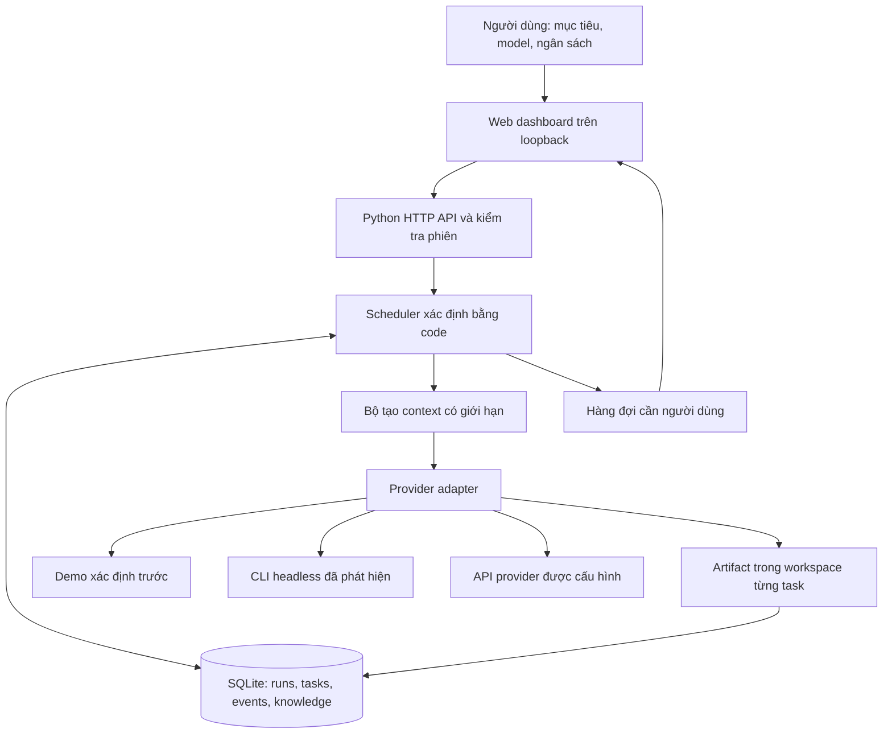
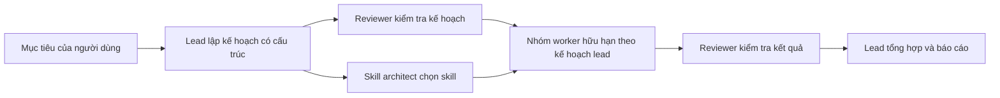

# Kiến trúc ĐỀ XUẤT — Orchestra Local

**Trạng thái: PLAN ONLY — ngày 02/10/2026.** Theo điều chỉnh của người dùng, hiện chỉ nghiên cứu và duyệt kế hoạch, chưa tiếp tục triển khai. Mã nguồn tạo trước điều chỉnh là **bản nháp đã ngắt, chưa nghiệm thu**. Mọi mô tả “MVP” dưới đây là phạm vi đề xuất trong tương lai, không phải tính năng đã bàn giao. Xem [PRODUCT_PLAN.md](PRODUCT_PLAN.md) để duyệt sản phẩm và [ROADMAP.md](ROADMAP.md) để xem tiêu chí nghiệm thu.

## 1. Mục tiêu và giới hạn

Một người dùng giao mục tiêu cho một **lead**, chọn các provider/model sẵn có trên máy, rồi theo dõi một quy trình có planner, reviewer, skill architect và worker. Khi một nhánh cần con người quyết định, nhánh đó tạm dừng; các nhánh độc lập vẫn tiếp tục.

Git lưu lịch sử mã nguồn và, ở giai đoạn sau, giúp cô lập thay đổi bằng worktree. Git không thay thế scheduler, cơ sở dữ liệu trạng thái hay kênh trao đổi. Cấu trúc thư mục local và SQLite đủ cho MVP; chưa cần một cụm máy, message broker hoặc graph database riêng.

Hệ thống hướng đến hiệu quả có thể đo: chất lượng đầu ra, tỷ lệ hoàn tất, độ trễ, số lần retry và lượng context gửi đi. Không có cơ chế nào bảo đảm đồng thời chất lượng tối đa, thời gian tối thiểu và token tối thiểu trên mọi nhiệm vụ. Các mục tiêu này phải được đặt thành ngân sách và đo bằng bài kiểm tra phù hợp dự án.

## 2. Sơ đồ thành phần



MVP được đề xuất dùng Python standard library, SQLite và giao diện HTML/CSS/JavaScript. Một tiến trình quản lý trạng thái giúp việc cài đặt và khởi động lại dễ kiểm tra. Bản đầu hướng tới một người dùng trên một máy; không phải dịch vụ nhiều tenant. Stack cuối cùng được chốt sau khi duyệt phạm vi.

### Engine local và vai trò của n8n

Đề xuất engine local portable là nguồn sự thật về task, attempt, quyền và pending/resume. n8n có thể làm ingress tùy chọn: nhận webhook/schedule/sự kiện, tạo run qua API và nhận kết quả. Không đặt toàn bộ lifecycle agent trong n8n rồi xây một scheduler cạnh tranh ở bên cạnh: CLI/process, sandbox, Git/worktree, context và reconciliation vẫn cần lớp chuyên trách.

Ingress ngoài cần authentication, scope, idempotency và callback có kiểm tra nguồn. Chỉ engine quyết định retry task; n8n không tự replay một side effect chưa biết kết quả. Portable là định hướng cấu trúc, còn process isolation và credential store phải được xác minh theo hệ điều hành.

## 3. Hai chế độ phải phân biệt rõ

| Chế độ dự kiến | Điều cần triển khai và chứng minh | Điều không được suy ra |
|---|---|---|
| Demo | Scheduler, SQLite, task/event, workspace, context và thao tác chờ người dùng hoạt động local; nội dung agent được tạo xác định trước | Không có model nào đã suy luận; số token không phải usage do provider báo |
| Provider thật | Adapter gọi API hoặc subprocess của CLI đã được cấu hình; đầu ra được đưa qua bộ kiểm tra schema và chính sách | CLI đã cài không đồng nghĩa đã đăng nhập; có model trong catalog không đồng nghĩa tài khoản dùng được model đó |

Không điền điểm benchmark giả, chi phí giả hay nhãn “đã xác thực” dựa chỉ vào sự hiện diện của binary. Demo phải luôn có nhãn riêng trong giao diện và artifact.

## 4. Vòng đời một nhiệm vụ



**Đề xuất:** lead sinh kế hoạch JSON; reviewer và skill architect đánh giá song song. Lead nhận phản biện và chỉnh kế hoạch tối đa **hai vòng theo mặc định đề xuất**, có version và lý do thay đổi. Không dựng vòng hội thoại mở vô hạn. Các worker chỉ được tạo từ kế hoạch đã kiểm tra: số task có trần, dependency hợp lệ, không cycle, không tham chiếu task ngoài run.

Reviewer gửi vấn đề trong phạm vi cho lead xử lý; chỉ vấn đề thiếu thông tin hoặc vượt quyền mới mở yêu cầu cho con người. Nội dung model không được tự phê duyệt yêu cầu đó hoặc tự tăng ngân sách. Hết số vòng mà chưa hội tụ, lead trình bày bất đồng và lựa chọn cụ thể.

Mỗi task cần có tối thiểu: mục đích, đầu ra mong muốn, tiêu chí hoàn tất, dependency, role, provider/model, workspace, mức ngân sách và tình trạng thực thi. Reviewer đánh giá artifact theo tiêu chí của task; “model nói đã xong” chưa phải bằng chứng một thay đổi mã nguồn đã qua test.

### Vai trò

| Vai trò | Trách nhiệm | Giới hạn |
|---|---|---|
| Lead | Hiểu mục tiêu, chia việc, nêu giả định, tổng hợp đầu ra và đề xuất xử lý lỗi | Không được tự cấp quyền cao hơn hoặc tự nhận thêm tài khoản |
| Reviewer | Tìm thiếu sót trong kế hoạch/kết quả, chỉ ra bằng chứng còn thiếu, yêu cầu người dùng khi cần | Không biến đề nghị thành approval; không lặp review vô hạn |
| Skill architect | Chọn skill theo dự án, cung cấp hướng dẫn và khuyến nghị nguồn phù hợp cho worker | MVP chỉ phân phối pack builtin local; khuyến nghị URL không đồng nghĩa đã tải, kiểm tra hoặc cài repository đó |
| Worker | Hoàn thành một task có phạm vi hẹp, xuất artifact và báo hạn chế | Không tự thay đổi DAG, tự spawn không giới hạn hay tự mở rộng phạm vi viết |
| Scheduler | Chuyển trạng thái hợp lệ, chọn task ready, giữ giới hạn song song, ghi sự kiện | Quyết định bằng code; không giao quyền quản lý trạng thái cho prompt |
| Người dùng | Chọn model/provider và xử lý những quyết định vượt quyền đã giao | Mỗi quyết định được gắn với task đang chờ; cần có dấu vết xử lý |

Chọn “model mạnh nhất” cho lead là lựa chọn cấu hình của người dùng, không phải một kết luận mặc định từ tên model. Reviewer có thể dùng model khác để giảm việc lặp cùng một kiểu sai, nhưng cũng tăng chi phí và không bảo đảm độc lập về lỗi.

## 5. DAG, lỗi và chờ người dùng

Trạng thái khái niệm: `queued`, `running`, `completed`, `waiting_human`, `cancelled`, `blocked`. Tên hiển thị/API có thể được chuẩn hóa trong triển khai, nhưng các quy tắc sau phải giữ nguyên:

1. Task chỉ ready khi mọi dependency bắt buộc đã hoàn tất.
2. Task đang chờ người dùng không chiếm một slot worker đang chạy.
3. Sibling không phụ thuộc task đang chờ vẫn được chạy.
4. Dependency bị hủy khiến task phụ thuộc bị chặn; không giả lập thành kết quả thành công.
5. Lỗi được phân loại; worker và lead xử lý lỗi thường lệ trong phạm vi được giao. Không đẩy mọi lỗi về người dùng và không retry vô hạn.
6. Người dùng có thể yêu cầu retry, cung cấp kết quả hoặc hủy task khi cần. Retry hữu hạn theo loại lỗi; **3 retry là giá trị khởi điểm để đánh giá**, chưa phải cam kết cố định. UI phải phân biệt retry với tổng attempts.
7. Khi khởi động lại, attempt chưa rõ kết quả đi vào reconciliation/pending. Không tự replay tác vụ có thể đã tạo side effect; chỉ yêu cầu người dùng nếu engine/lead không đủ bằng chứng hoặc quyền để đối chiếu.
8. Mọi thay đổi trạng thái và quyết định được ghi event. Không chỉ lưu một chuỗi hội thoại rồi cố tái suy ra trạng thái.

**Thông báo MVP:** hàng đợi và sự kiện trong dashboard. Ping hệ điều hành, email, Slack hoặc dịch vụ ngoài là lộ trình; gửi thông báo ra ngoài cần cấu hình kênh và được người dùng cho phép. Việc lead “tiếp tục điều phối” được thực hiện bằng scheduler chạy nhánh độc lập, không cần trả thêm token cho một model chỉ để hỏi có task nào sẵn sàng.

**Giới hạn khôi phục:** SQLite lưu được trạng thái, không tự tạo ngữ nghĩa exactly-once cho API/CLI bên ngoài. Các thao tác có side effect cần idempotency key hoặc bước đối chiếu trước khi retry ở giai đoạn sau.

### Chính sách lỗi dự kiến

| Loại lỗi | Xử lý trong hệ thống | Khi cần người dùng |
|---|---|---|
| Output sai schema | Cho worker một lượt sửa có giới hạn, sau đó lead quyết định đổi cách làm | Lead thiếu thông tin hoặc thay đổi scope/quyền |
| Rate limit/transient network | Backoff có deadline; `waiting_resource`/`retry_scheduled` không chiếm slot | Hết ngân sách chờ hoặc cần tài khoản/quota mới |
| Test/validation fail | Worker sửa hữu hạn; lead chia lại hoặc điều chỉnh plan trong quyền | Cần thay đổi yêu cầu hoặc quyền |
| Auth/permission/budget/scope | Dừng nhánh tương ứng, nêu bằng chứng và lựa chọn trong Inbox | Người dùng login/cấp quyền/chọn ngân sách hoặc thu hẹp scope |
| Dependency sai | Chặn nhánh và giao lead sửa DAG qua validation/version | Quyết định nghiệp vụ còn thiếu |
| Side effect không rõ | Đối chiếu trạng thái/idempotency trước retry | Không đủ bằng chứng hoặc quyền để xác minh |

Quy tắc “mọi lỗi đều chờ người dùng” có thể xuất hiện trong bản nháp đã ngắt; đó không phải thiết kế sản phẩm được đề xuất ở đây.

## 6. Workspace, rule và artifact

Cấu trúc logic trong MVP:

```text
.orchestra/
  runs/<run-id>/
    <task-id>/
      AGENTS.md
      CONTEXT.md
      ...artifact của task...
```

`AGENTS.md` ghi role, phạm vi và quy tắc báo cáo. `CONTEXT.md` chứa mục tiêu đã rút gọn, yêu cầu của task, tóm tắt dependency và những knowledge record đã truy hồi. Các file này là hợp đồng hướng dẫn cho model; **không phải cơ chế sandbox của hệ điều hành**.

Adapter API chỉ tiếp nhận các file đầu ra có đường dẫn tương đối và giới hạn kích thước/số lượng. Backend phải kiểm tra đường dẫn sau khi resolve và không cho phép traversal, đường dẫn tuyệt đối hay thoát workspace qua symlink/junction. API-generated files không tự trở thành lệnh shell để thực thi.

Adapter CLI cần chính sách riêng về quyền đọc, viết, subprocess và network. Codex được gọi bằng chế độ sandbox giới hạn ghi workspace nếu runtime hỗ trợ. Các CLI khác chỉ được cho chạy tự động theo những cờ an toàn mà bản cài thực sự hỗ trợ; không coi một working directory là sandbox. Tính hữu dụng của adapter và mức cô lập phải được hiển thị riêng.

MVP cô lập đầu ra theo thư mục task. Git repository riêng cho task, nếu có, chỉ hỗ trợ theo dõi thay đổi; không cho rằng task đã nhìn thấy hoặc sửa được một checkout dự án đầy đủ. Worktree trên repository của người dùng, file ownership, kiểm tra xung đột, review diff và merge có kiểm soát thuộc giai đoạn tiếp theo.

## 7. Model, tài khoản và credentials

### Bốn lớp trạng thái khác nhau

| Lớp | Bằng chứng đủ |
|---|---|
| Installed | Tìm thấy executable cho phép và đọc được version/help |
| Catalog available | CLI/API liệt kê được model; có ngày lấy dữ liệu và provider |
| Authenticated | Chính công cụ/provider báo phiên đăng nhập hợp lệ bằng cơ chế hỗ trợ |
| Execution verified | Một request thật với provider/model cụ thể đã thành công trong thời gian được ghi nhận |

Discovery ưu tiên binary trong PATH và lệnh metadata được tài liệu hóa. Không quét toàn ổ đĩa, đọc browser profile, trích cookie hoặc thu gom token đăng nhập. Việc mở ứng dụng desktop không tự cấp cho orchestrator quyền truy cập subscription qua HTTP.

**Đề xuất:** từng agent hoặc nhóm worker được người dùng gán client/connection/model/environment, tool policy, skill pack và budget riêng; cấu hình snapshot theo run. API key được nhập trong vùng Connections. RAM-only là phương án prototype; OS credential store là phương án lưu bền vững cần chốt. Không ghi plaintext vào SQLite, repository, prompt hay log; endpoint trạng thái chỉ trả metadata masked. RAM-only cần nhập lại key sau restart và không được quảng bá như một vault.

CLI dự kiến dùng phiên đăng nhập chính thức của chính client. Login flow mở terminal/browser hoặc hướng dẫn lệnh chính thức để người dùng hoàn tất OAuth/login; UI không thu mật khẩu và không sao chép token sang provider khác. Nhiều account cần profile chính thức hoặc process/user isolation đã xác minh; không tự sửa cấu hình quyền toàn máy.

### Phát hiện trên máy tại thời điểm khảo sát

Kết quả khảo sát local ngày 02/10/2026: `codex 0.153.4`, `opencode 1.17.7`, `agy 1.2.14`. Đây là ảnh chụp môi trường phát triển, không phải yêu cầu version tối thiểu hoặc cam kết rằng các phiên đăng nhập đều dùng được. Chưa có request inference chỉ từ việc đọc version/catalog.

| Công cụ | Hướng tích hợp | Điều cần xác minh riêng |
|---|---|---|
| Codex | Native headless `exec --json`, dùng login do CLI quản lý | Sandbox thực tế, model entitlement, cấu trúc output của version cài |
| OpenCode | Integration thực thi đầy đủ được lên kế hoạch qua CLI hoặc server/API chính thức | Version/protocol, login/provider profile, session isolation, tool permissions, cancel/resume và inference |
| Antigravity | Integration thực thi đầy đủ được lên kế hoạch qua native headless CLI | Catalog/entitlement, login, tool permissions, sandbox/process isolation, cancel/resume và inference |
| Z.ai | HTTP API dùng bearer key hoặc cấu hình provider chính thức trong OpenCode | Endpoint/API plan và Coding Plan có thể khác; không dùng nhầm thông tin gói |

Tài liệu chính thức tham khảo: [Codex non-interactive mode](https://learn.chatgpt.com/docs/non-interactive-mode), [Codex authentication](https://learn.chatgpt.com/docs/auth), [OpenCode CLI](https://opencode.ai/docs/cli/), [OpenCode server](https://opencode.ai/docs/server/), [Antigravity headless CLI](https://antigravity.google/docs/cli/headless/), [Z.ai kết nối OpenCode](https://docs.z.ai/devpack/tool/opencode), [Z.ai API quick start](https://docs.z.ai/guides/overview/quick-start). Cả Codex, OpenCode và Antigravity là integration chính thức trong kế hoạch. Chưa qua gate capability/auth/isolation là task cần xác minh, không phải kết luận client không thể được hỗ trợ.

## 8. Context và ngân sách

Mỗi worker nhận một context pack nhỏ: mục tiêu toàn cục cần thiết, mục tiêu task, tiêu chí nghiệm thu, tóm tắt dependency, tham chiếu artifact và tri thức liên quan. Không broadcast toàn bộ lịch sử chat cho tất cả worker. Trao đổi chung đi qua task result/artifact/event; nội dung không liên quan không cần sao chép sang context khác.

**MVP:** bộ tạo context cắt giới hạn nội dung và ước lượng token bằng quy tắc gần đúng ký tự/4; scheduler kiểm tra trước khi dispatch và sau khi nhận output. Con số này phục vụ planning. Tiếng Việt, mã nguồn, tokenizer khác nhau và tool messages có thể làm sai lệch đáng kể.

**Đây không phải hard cap hóa đơn.** Một CLI có thể thực hiện nhiều call nội bộ; server chỉ thấy một phần usage. Kiểm tra sau output không thu hồi phí đã phát sinh. Timeout **180 giây** là giá trị khởi điểm cần đánh giá theo loại task, chưa phải cam kết cố định; timeout local cũng không bảo đảm request từ xa đã ngừng tính phí. Hard cap cần quota từ provider hoặc adapter kiểm soát đầy đủ mọi call.

Đo lường nên phân biệt: context token ước lượng, usage chính thức nếu provider trả về, wall-clock, số attempt và chi phí tính theo bảng giá có ngày cập nhật. Giá trị không quan sát được phải để trống hoặc ghi “unknown”.

Lộ trình tối ưu: incremental summary, cache kết quả có fingerprint, giới hạn output theo loại task, model nhỏ cho bước rõ ràng, model mạnh cho quyết định khó, và cơ chế ngừng review khi thêm vòng không cải thiện tiêu chí đo được.

## 9. Skill architect và chuỗi cung ứng skill

Skill architect là bước bắt buộc mỗi run; mọi task có skill manifest riêng hoặc manifest tham chiếu pack chung. Không cần thêm một model call hoặc tìm GitHub lại cho mỗi task. Service dùng catalog/cache đã review trước; chỉ discovery hoặc đánh giá bổ sung khi task thiếu capability, dependency thay đổi hoặc skill cũ không phù hợp. Pack builtin là điểm khởi đầu; tìm/pin/review/cài từ nguồn ngoài là phạm vi chính thức của kế hoạch.

Đầu ra tối thiểu: skill nào phù hợp role/task, vì sao, file/rule áp dụng và nguồn đề xuất. Khi khuyến nghị skill bên ngoài, yêu cầu ghi repository, đường dẫn, revision/commit nếu đã xác minh, quyền cần dùng và lý do cần thiết. Không tạo commit hash giả để làm nguồn trông đáng tin.

**Lộ trình cài remote:** tìm nguồn → đọc manifest/SKILL.md → kiểm tra license và script → pin commit → so diff/quyền → sandbox thử → phân phối theo role. Skill chứa instruction là dữ liệu không đáng tin cho đến khi được đánh giá; không được ghi đè quyền hệ thống, lấy key hoặc gửi dữ liệu chỉ vì README/SKILL.md yêu cầu. Installation policy cần dựa trên phạm vi đã được người dùng ủy quyền, không thêm hộp thoại cho mọi thao tác vô hại.

Plugin/MCP và skill có vai trò khác nhau: skill cung cấp quy trình/instruction; plugin/MCP có thể mở công cụ hoặc dữ liệu với quyền thật. Registry cần lưu cả loại tài nguyên và quyền có thể gây side effect.

## 10. Knowledge graph nhẹ và benchmark registry

### Graph trong MVP

SQLite lưu knowledge node, nội dung/ngữ cảnh nguồn, và cạnh có kiểu giữa các node. Tìm kiếm văn bản và lọc theo task/project cung cấp context nhỏ cho worker. Index trên khóa/quan hệ hỗ trợ truy cập dữ liệu; không nên mô tả tìm kiếm chuỗi đơn giản như một semantic search engine.

Các loại tri thức hữu ích: requirement, decision, artifact, task, skill, model, benchmark và issue. Ví dụ: `task --produces--> artifact`, `decision --supported_by--> benchmark`, `skill --applies_to--> task`. Chỉ tạo cạnh đã có bằng chứng hoặc ghi rõ đó là đề xuất; độ tự tin do model tự báo không thay thế provenance.

Graph là bộ nhớ chung có cấu trúc, không phải cách truyền toàn bộ tri thức cho mọi model với chi phí bằng không. Truy hồi vẫn phải chọn nội dung đưa vào context. Vector embeddings, semantic ranking, GraphRAG nhiều bước và graph database riêng chỉ nên thêm sau khi có bài đo cho thấy truy hồi văn bản bỏ lỡ thông tin cần thiết.

### Benchmark trong MVP

Cho phép nhập thủ công dữ liệu có `model`, `suite`, `score`, `source` và `date`. Không seed các điểm tự bịa. Các bản ghi không cùng suite, version, setup và cách đo không được cộng thành “điểm mạnh tổng hợp” như thể chúng tương đương.

Schema ở giai đoạn tiếp theo nên bổ sung: model snapshot/version, provider, eval harness/version, task domain, sample size, confidence interval nếu có, ngày thu thập, ngày chạy eval, quyền sử dụng dữ liệu, latency/cost setting và trạng thái đã kiểm chứng. Model routing dùng cả capability, ngân sách, availability, policy và kết quả eval trên dự án.

Nguồn công khai chỉ là prior tham khảo. Một tập bài test đại diện cho repository của người dùng mới trả lời được model nào làm loại task cụ thể hiệu quả. Không tự động crawl benchmark không giới hạn hoặc tạo ranking từ các quảng cáo của provider.

## 11. Trust boundary và quyền thực thi

| Biên | Quy tắc MVP / yêu cầu trước khi mở rộng |
|---|---|
| Browser → backend | Bind `127.0.0.1`, kiểm tra Host/Origin và token phiên cho API thay đổi trạng thái; không coi localhost là đủ chống request từ website ngoài |
| User config → run | Snapshot role/provider/model; kiểm tra kiểu dữ liệu, số task, dependency, đường dẫn và ngân sách |
| Model → scheduler | Parse/validate output; model chỉ đề nghị hành động, scheduler quyết định trạng thái hợp lệ |
| Model → filesystem | Giới hạn path và kích thước cho API output; CLI cần sandbox/quyền runtime riêng |
| Provider → log | Không ghi key, auth header hoặc request chứa credential; sanitize lỗi trước khi hiển thị |
| Remote skill → worker | Nội dung ngoài là dữ liệu chưa tin; không được tự nâng quyền hoặc tự cài script |
| Human action → task | Chỉ áp dụng hành động phù hợp trạng thái hiện tại; ghi event và tránh double submit |

MVP không phải sandbox chống một người có quyền admin trên cùng máy. Cũng không bảo đảm một CLI bên thứ ba không đọc được file ngoài workspace chỉ vì được khởi động bên trong một folder. Những giới hạn này phải rõ trước khi cấp quyền viết vào dự án thật hoặc kết nối tài khoản có chi phí.

## 12. Các phần mở rộng đề xuất, chưa được nghiệm thu

- Canvas workflow kiểu n8n, kéo thả và custom workflow graph.
- Tích hợp luồng login chính thức và quản lý profile nhiều tài khoản; không thu gom cookie/token từ ứng dụng khác.
- Vault lưu key bền vững, multi-user, RBAC và truy cập từ mạng ngoài.
- Tự tìm/cài skill từ GitHub, marketplace plugin hoặc MCP server bất kỳ.
- Thu thập benchmark có nguồn và router theo nhóm nhiệm vụ có thể so sánh; không xây điểm năng lực tuyệt đối từ các suite khác nhau.
- Worktree management, tự test mọi dự án, tự merge thay đổi và xử lý conflict không cần review.
- Vector retrieval/GraphRAG, distributed worker pool, thông báo chủ động qua kênh bên ngoài.

Các phần này có chỗ trong lộ trình; thứ tự triển khai được quyết định khi duyệt kế hoạch. Hiện chưa có chức năng nào trong tài liệu này được coi là đã bàn giao chỉ dựa trên mã nháp.

## 13. Client, provider, account và environment

Client/runtime (Codex/OpenCode/Antigravity), provider (dịch vụ model), account/credential profile (danh tính và nguồn quota), model (ID cụ thể) và role (vai trò agent) là các đối tượng riêng. Một client có thể dùng nhiều provider; cùng tên model qua hai kết nối có thể khác quota/giá/quyền. OpenAI-compatible là kiểu giao thức, không phải tên nhà cung cấp hay bảo đảm feature tương đương.

Lead/reviewer/skill architect/worker có cấu hình riêng và có thể khác client, model, account và environment. Lead chỉ đề xuất routing; không tự lấy tài khoản khác khi hết quota. Account quota group tránh việc nhiều profile dùng cùng tài khoản nhưng bị tính concurrency như các nguồn độc lập.

### Connection profile dự kiến

| Nhóm | Trường cốt lõi |
|---|---|
| Identity | id, tên, provider/API family, environment, owner, quota group |
| Endpoint/model | base URL, API variant, catalog source/timestamp, model allowlist |
| Auth | auth type, key/token reference, header name, trạng thái/expiry nếu quan sát được |
| Request | custom headers, API version, timeout, stream timeout, output cap |
| Network | TLS verification, CA bundle reference, proxy profile, endpoint allowlist |
| Resources | rate limit, concurrency, bounded retry/backoff, token/cost budgets, giá có ngày |
| Evidence | version/capability matrix, lần auth/inference verified gần nhất |

Auth dự kiến hỗ trợ API key/bearer/header theo API family, login chính thức của client và no-auth cho endpoint local được cho phép. Native Responses/Messages/Gemini và compatible Chat Completions có adapter/schema riêng. Header/proxy chứa secret dùng reference; export chỉ mang placeholder/reference. Model không được tự đổi endpoint/auth. Redirect không tự mang key sang host khác. TLS verify bật mặc định, CA nội bộ cấu hình rõ thay vì bỏ kiểm tra TLS.

### Environments

dev/test/prod có variables, secret bindings, connection profiles, tool policy, budget và artifact namespace riêng. **Không kế thừa key mặc định.** Chuyển workflow sang môi trường khác phải map profile và secret reference rõ ràng; key thiếu phải báo thiếu, không fallback key dev/global. Worker chỉ nhận biến cần thiết, không toàn bộ process environment.

Biến thường có thể có inheritance hiển thị rõ; secret và quyền cần binding riêng. Run giữ snapshot cấu hình và references, không secret value. Có key production không tự cấp quyền deploy hoặc gọi workflow production.

## 14. Node API/workflow và routing

| Node | Input/output có cấu trúc | Quyền/giới hạn |
|---|---|---|
| LLM call | Context references → response schema | Profile/model, timeout, output/usage budget |
| Agent task | Goal/workspace/capability profile → artifacts/result | Session/process isolation, tool scope, cancel |
| Tool/function | Typed arguments → typed result/artifact | Allowlist, side effects, idempotency và timeout |
| Retrieval | Query + scope → evidence references | Lọc quyền trước, giới hạn byte/node/context |
| Validation | Artifact/schema/test spec → pass/fail/findings | Validator xác định; command chỉ trong quyền đã giao |
| Human approval | Action + diff/evidence → approve/reject/input | Bind task/action/revision/hash, audit; timeout không phải approval |
| Routing | Typed status → nhánh tiếp theo | Điều kiện/nhãn cho phép, không eval code tùy ý của model |

Node giữ schema, dependency, criteria, retry/cancellation policy và version. Output model chỉ đề nghị chuyển trạng thái; scheduler xác minh. Tool call không được chạy chỉ vì model phát một chuỗi trông như lệnh. Retry được phân loại như mục 5 và phải đối chiếu side effect trước khi replay.

## 15. Schema knowledge và benchmark để triển khai thực dụng

| Record | Trường đề xuất |
|---|---|
| Knowledge node | id, project/environment scope, type, title/summary, content/artifact ref, hash, source refs, updated_at, validity |
| Knowledge edge | from/to, relation allowlist, evidence ref, creator, asserted/inferred, scope |
| Source | URL/file/artifact, revision/hash, observed_at/collected_at, license/access scope |
| Decision | câu hỏi, phương án, lựa chọn, lý do, actor, approval ref, superseded_by |
| Model | provider/model ID/snapshot, capabilities, source, verification, catalog timestamp |
| Benchmark | suite/version, harness/commit, task domain, score/unit, sample size/uncertainty nếu có, setup, date, source |
| Pricing | model/version, unit/currency, input/output/cache, effective date, API/subscription distinction |

SQLite kiểm tra khóa ngoại và relation types; retrieval lọc project/environment/quyền trước khi text/entity/edge lookup. Cạnh suy ra cần evidence và nhãn riêng, không lấy model confidence làm sự thật. Secret không vào graph.

Manual benchmark import có provenance trước; collectors về sau có cache/freshness và quyền nguồn. Eval local dùng cùng setup/baseline để quyết định routing. Chỉ thêm vector/GraphRAG hoặc graph DB khi bài đo chứng minh truy hồi hiện tại không đủ.
