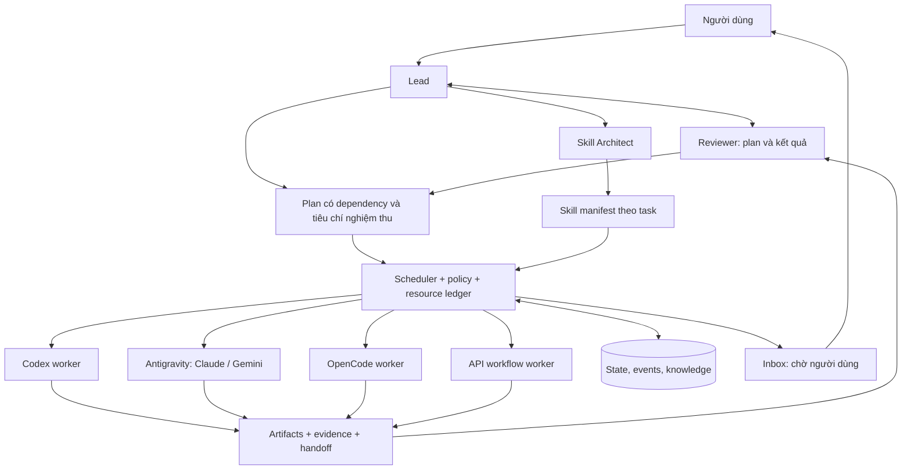

# Agent Orchestra: môi trường điều phối agent local

Ngày thiết kế: **02/10/2026**. Phạm vi hiện tại: **nghiên cứu và plan**, theo điều chỉnh mới nhất của người dùng. Các lựa chọn kỹ thuật dưới đây là đề xuất, chưa phải cam kết tính năng đã hoạt động.

## 1. Kết luận khả thi

Có thể xây dựng một ứng dụng local để một lead tiếp nhận yêu cầu, cùng reviewer lên kế hoạch, chọn và giao task cho nhiều model qua các client và API khác nhau. Git quản lý phiên bản và vùng làm việc; scheduler và cơ sở dữ liệu giữ trạng thái, điều phối task và trao đổi kết quả.

Phần khó nhất không nằm ở việc cho nhiều model trò chuyện. Nó nằm ở việc chuẩn hoá quyền truy cập, xử lý phiên chạy lỗi/gián đoạn, giới hạn chi phí và context, kiểm tra kết quả, và giữ nhiều worker không ghi đè công việc của nhau.

Mục tiêu sản phẩm nên là **đạt tiêu chí chất lượng trong ngân sách thời gian và tài nguyên do người dùng chọn**. Không nên hứa luôn đạt chất lượng tối đa đồng thời dùng ít token và ít thời gian nhất; các mục tiêu có đánh đổi và phải đo bằng workload thực.

### Những điều đã thống nhất trong cuộc trao đổi

- Chạy local trên máy Windows, có một thư mục dự án và giao diện quản lý.
- Lead nhận yêu cầu trực tiếp; có reviewer phản biện và Skill Architect.
- Hỗ trợ kế hoạch kết nối Codex, OpenCode, Claude/Gemini qua Antigravity, Z.AI và các API key độc lập.
- Người dùng chọn provider/model sau bước phát hiện tài nguyên.
- Worker được tự tạo/sửa file trong phạm vi dự án được giao; quyền vượt phạm vi đưa về hàng chờ.
- Task đang chờ không chặn các nhánh độc lập.
- Có thông tin năng lực model, bộ nhớ dùng chung và hướng phát triển knowledge graph.
- **Hiện chỉ lên plan, chưa tiếp tục triển khai.**

## 2. Phân biệt các lớp tài nguyên

| Lớp | Ví dụ | Hệ thống cần lưu |
|---|---|---|
| Client / runtime | Codex CLI, Antigravity CLI, OpenCode | Version, đường dẫn, giao thức, capability, quyền và khả năng resume/cancel |
| Kết nối / tài khoản | Account Antigravity A, OpenAI API project B, Z.AI profile C | Cách đăng nhập, secret reference, nguồn quota, giới hạn, môi trường được dùng |
| Provider | OpenAI, Anthropic, Google, Z.AI hoặc endpoint tự cấu hình | API dialect, endpoint, model discovery, rate limits |
| Model | ID đúng do client/provider trả về hoặc người dùng nhập | Model revision, context, modalities, tool/schema support, bằng chứng năng lực |
| Vai trò | Lead, reviewer, skill architect, worker | Model được chọn, skill pack, tool policy, budget và quyền ghi |
| Phiên thực thi | Một task trên một workspace | Prompt/context version, session ID, usage, artifacts, trạng thái và lỗi |

Một model xuất hiện qua hai kết nối vẫn là hai lựa chọn vận hành khác nhau. Không tự dùng key Anthropic thay tài khoản Antigravity, không tự chuyển quota thuê bao sang API, không tự chọn một tài khoản khác khi hết hạn mức.

Khảo sát tại máy phát hiện Codex CLI **0.153.4**, OpenCode **1.17.7**, Antigravity CLI **1.2.14**. Antigravity trả được catalog có Claude và Gemini. Đây là bằng chứng discovery; vẫn cần kiểm tra đăng nhập, quyền model và inference khi đến giai đoạn triển khai. Chi tiết nguồn và giới hạn: [INTEGRATIONS.md](INTEGRATIONS.md).

## 3. Trải nghiệm đầu đến cuối

1. **Tạo project.** Người dùng chọn một folder, phạm vi ghi và loại công việc. Hệ thống kiểm tra Git và đề xuất khởi tạo hoặc dùng repo hiện có khi triển khai.
2. **Phát hiện tài nguyên.** Đọc executable, version và capability qua giao diện chính thức. Phân biệt rõ đã cài, có catalog, đã đăng nhập, và đã kiểm chứng inference. Không quét lấy credential từ ứng dụng khác.
3. **Kết nối.** Thêm account-backed client hoặc connection profile dùng API key. Đăng nhập đi qua luồng chính thức của client/provider; UI không nhận mật khẩu tài khoản.
4. **Chọn đội ngũ.** Hệ thống đề xuất lead/reviewer/skill architect/worker pool dựa trên tài nguyên thực và benchmark có nguồn. Người dùng chọn một lần; lưu preset cho các run sau, cho phép override theo run.
5. **Giao mục tiêu.** Nhập kết quả mong muốn, deadline, budget, tiêu chí chấp nhận và quyền đã giao. Yêu cầu còn mơ hồ được lead làm rõ khi ảnh hưởng đáng kể đến kết quả.
6. **Lên kế hoạch.** Lead tạo bản plan có dependency; reviewer phản biện. Lead chỉnh sửa tối đa hai vòng theo mặc định đề xuất. Hệ thống hiển thị plan, giả định và ước lượng; scope đã được uỷ quyền có thể chạy tự động.
7. **Chuẩn bị skill.** Skill Architect kiểm tra nhu cầu, chọn pack đã được review hoặc đề xuất pack mới, rồi gắn manifest cho các task phù hợp.
8. **Thực thi.** Scheduler chạy các task đủ dependency và còn tài nguyên. Worker nhận context gọn cùng workspace riêng. Các bên trao đổi message có cấu trúc và tham chiếu artifact.
9. **Xử lý vướng mắc.** Lỗi kỹ thuật có retry hữu hạn; lead xử lý vấn đề trong quyền. Quyết định vượt quyền, thiếu thông tin hoặc rủi ro không tự giải được chuyển sang Inbox. Scheduler tiếp tục các nhánh khác.
10. **Kiểm định và bàn giao.** Reviewer kiểm tra bằng chứng, test runner xác nhận nếu có. Lead tổng hợp artifact/diff, các kiểm tra đã chạy, điểm chưa xác minh, usage và công việc còn lại.

## 4. Cấu trúc điều phối đề xuất



Lead quyết định về nội dung và phương án; scheduler quyết định chuyển trạng thái và tài nguyên theo chính sách. Không gọi một model liên tục chỉ để kiểm tra xem có task ready hay không.

### Hợp đồng task

Mỗi task chứa `task_id`, phiên bản plan, mục tiêu, tiêu chí nghiệm thu, dependencies, owner role, provider/model connection, workspace, input artifact references, output schema, deadline, retry policy, context budget, usage budget và tool policy. Lead đề xuất thay đổi plan; scheduler validate cycle, quyền, budget và revision trước khi áp dụng.

### Chờ phản hồi và phục hồi

Phân biệt `waiting_human`, `waiting_resource`, `retry_scheduled`, `blocked_dependency` và `failed`. Quota hết có thể chờ thời điểm phù hợp; thiếu quyết định cần con người; lỗi schema có thể sửa trong giới hạn. Các trạng thái này không nên gộp thành một ô “lỗi”.

Mỗi yêu cầu người dùng nêu rõ task, vấn đề, bằng chứng, lựa chọn đề xuất, tác động và phạm vi quyền cần thêm. Phản hồi gắn đúng task/action/revision; phản hồi cũ không tự mở một action mới. Tiếp tục sau restart cần đối chiếu side effect, không tự thực hiện lại mù quáng.

## 5. API key và môi trường workflow

Đây là một nhánh chính của sản phẩm, không chỉ là một ô nhập key trong Settings.

### Connection profile

Mỗi profile có tên dễ hiểu, provider/API dialect, base URL, danh sách model, auth type, secret reference, các header bổ sung được kiểm soát, timeout, proxy/TLS khi cần, rate limits và giới hạn chạy đồng thời. API key được nhập qua giao diện riêng, che giá trị và không hiển thị lại. Bản đầu có thể giữ key trong RAM; lưu bền vững nên dùng credential store của hệ điều hành.

Các dialect dự kiến: OpenAI Responses, OpenAI-compatible Chat Completions, Anthropic Messages, Gemini và Z.AI theo endpoint/gói thực tế. “OpenAI-compatible” là một mức tương thích cần kiểm tra, không phải bảo đảm mọi tham số hay tool đều hoạt động như nhau.

### Environments

Một project có các profile môi trường như `development`, `test`, `production`. Mỗi môi trường ánh xạ connection và các biến cấu hình đến secret references riêng. Worker chỉ nhận các biến cần thiết; không thừa hưởng toàn bộ environment của tiến trình điều phối.

Môi trường production không mặc nhiên được bật chỉ vì có key được lưu. Quyền theo project/run quyết định workflow nào được gọi môi trường nào. Log chỉ ghi tên profile và secret reference đã che, không ghi key, authorization header hoặc response nhạy cảm ngoài phạm vi.

### Workflow nodes

| Node | Trách nhiệm | Kết quả |
|---|---|---|
| Input / trigger | Nhận yêu cầu hoặc input định dạng sẵn | Input chuẩn hoá và run ID |
| Retrieve | Lấy facts và artifact cần thiết | Context có provenance |
| LLM call | Gọi model đã chọn với schema và budget | Response, usage, model revision |
| Tool / function | Gọi công cụ đã cấp quyền | Typed result và side-effect receipt |
| Validate | Kiểm tra schema, acceptance criteria, test | Pass/fail với evidence |
| Route / fan-out / join | Phân nhánh có điều kiện, chạy song song và tổng hợp | Dependency được scheduler quản lý |
| Human input | Chờ quyết định hoặc quyền bổ sung | Quyết định gắn action/revision |
| Artifact / handoff | Lưu output, diff và tóm tắt | Artifact reference và checksum |

Model chỉ đề xuất tool call; host kiểm tra schema, đường dẫn, destination và quyền trước khi gọi. Giai đoạn đầu ưu tiên tool đơn giản có input/output rõ; không mở một shell tùy ý cho mọi API model.

Có cơ chế reserve budget trước call, ghi usage sau call và đối chiếu chi phí theo bảng giá có nguồn. Với CLI/subscription không có số tiền hoặc quota đáng tin, hiển thị unknown hoặc ước lượng có nhãn. Giới hạn local không bảo đảm thu hồi request đã gửi hoặc hoàn tiền từ provider.

## 6. Context và phối hợp giữa model

Kênh chung nên là **sự kiện, message có kiểu và artifact**, thay vì gửi nguyên một group chat cho tất cả worker.

- Lead giữ bản mục tiêu và các quyết định toàn cục.
- Worker nhận mục tiêu task, các đoạn repo liên quan, rule/skill đang dùng, kết quả dependency và tiêu chí nghiệm thu.
- Reviewer nhận diff, kết quả kiểm tra và lập luận cần phản biện; không cần toàn bộ quá trình suy nghĩ của worker.
- Kết quả dài được lưu thành artifact; handoff trỏ tới nguồn và trích đoạn cần thiết.
- Các session cùng task có thể resume để tận dụng context/caching được provider hỗ trợ. Đổi task khác phải đánh giá lại context, không gộp vô hạn.

Phải đo tổng tài nguyên của **cả hệ thống**: lead, reviewer, Skill Architect, worker, retry và retrieval. Thêm agent có thể làm tổng token tăng dù từng worker dùng ít context hơn. Giảm fan-out, bỏ review trùng lặp và cache manifest sẽ được quyết định từ số liệu.

## 7. Skill Architect

Giữ Skill Architect như một vai trò bắt buộc được xét trong mọi dự án/run, và mọi task có skill manifest. Không bắt buộc trả tiền cho một phiên model mới ở từng task nếu manifest phù hợp đã có.

Pipeline đề xuất:

1. Hiểu stack, loại artifact, tiêu chí chất lượng và quyền của task.
2. Tra registry đã review trước; chỉ tìm GitHub/plugin registry khi chưa đáp ứng.
3. Đánh giá nội dung thật, license, maintainer, dependency, network/secret/shell permissions, mức tương thích và dấu hiệu prompt injection.
4. Ghim commit/version và content hash; chạy thử trong workspace đánh giá riêng.
5. Cài vào phạm vi dự án/worker được giao; lưu lockfile, nguồn và cách rollback.
6. Ghi nhận lợi ích bằng task success, thời gian và overhead context. Loại pack không giúp.

GitHub stars không đồng nghĩa chất lượng hay an toàn. Skill là hướng dẫn, plugin/MCP có thể chạy code hoặc truy cập dịch vụ; hệ thống phải phân biệt hai loại quyền. Pack đã được duyệt theo policy có thể cài tự động trong scope, còn quyền mới hoặc remote code chưa được review chuyển sang Inbox.

## 8. Knowledge graph và thông tin model

### Bộ nhớ dùng chung

Bản đầu nên bắt đầu với SQLite, chỉ mục tìm kiếm văn bản và các cạnh có kiểu. Ví dụ:

```text
Task ──produced──> Artifact
Artifact ──verified_by──> TestResult
Decision ──applies_to──> Project
Skill ──supports──> Capability
ModelRevision ──measured_by──> BenchmarkRun
Connection ──exposes──> ModelRevision
```

Mỗi fact cần `source`, `created_at`, `verified_at`, `scope`, mức tin cậy và `supersedes` khi có bản thay thế. Lưu raw artifact tách khỏi tóm tắt; không dùng tóm tắt mất nguồn làm sự thật tuyệt đối. Đề xuất của agent chỉ là candidate knowledge cho đến khi đủ bằng chứng.

Retrieval kết hợp phạm vi dự án, tìm kiếm văn bản và quan hệ dependency trước. Chỉ thêm embeddings, graph database hoặc GraphRAG sau khi đánh giá cho thấy retrieval hiện tại bỏ sót thông tin đáng kể. Knowledge graph có thể giúp tổ chức và truy xuất; không tự bảo đảm nhanh hơn hay ít token hơn.

### Model intelligence registry

Benchmark record cần model ID/revision, provider/harness, ngày đo, bộ bài test, metric/unit, cấu hình reasoning/tools, pass rate, latency, tokens/cost nếu có, số mẫu và source URL. Tách số liệu vendor, benchmark công khai và bài kiểm tra nội bộ.

Không cộng thẳng điểm từ các bộ benchmark khác nhau thành một điểm “thông minh”. Router ưu tiên: đủ capability và quyền → phù hợp task → đáp ứng ngưỡng chất lượng → phù hợp ngân sách → độ trễ. Người dùng có thể chốt model hoặc bật chính sách chọn trong danh sách cho phép.

“Mạng lưới riêng về model” nên bắt đầu bằng registry có provenance và lịch cập nhật đề xuất, cộng một tập eval nhỏ đúng loại dự án người dùng làm. Khi số nguồn/model tăng đủ lớn mới xây pipeline thu thập và đánh giá tự động. Không tự scrape hoặc chạy benchmark trả phí trong giai đoạn plan.

## 9. Giao diện dự kiến

| Khu vực | Nội dung chính |
|---|---|
| Mission / Chat với Lead | Mục tiêu, trao đổi, giả định và kết quả bàn giao |
| Workflow | Graph task, dependencies, trạng thái và owner/model |
| Inbox | Câu hỏi, lỗi cần quyết định, nguồn quota cần bổ sung |
| Resources | Clients, account profiles, API connections, chọn model theo role |
| Environments | Biến và secret refs, scope quyền, rate/budget limits |
| Skills & Plugins | Tìm kiếm, review, manifest, version lock và rollback |
| Knowledge | Facts, decisions, artifacts, search và quan hệ |
| Model intelligence | Catalog, benchmark provenance, freshness và routing rationale |
| Usage & Audit | Chi phí/token có nhãn nguồn, thời gian, retry, quyền và event log |

Giao diện workflow có thể lấy cảm hứng từ n8n. Không cần xây canvas kéo-thả hoàn chỉnh ngay: bản đầu có graph sinh từ plan và editor task đủ để kiểm chứng engine. n8n có thể được tích hợp về sau cho trigger, lịch chạy và hệ thống ngoài; lõi điều phối vẫn cần quản lý session, workspace, context và task lifecycle riêng.

## 10. Thứ tự phát triển và tiêu chí quyết định

| Giai đoạn | Đầu ra dự kiến | Điều kiện đi tiếp |
|---|---|---|
| 0. Chốt thiết kế | Capability matrix, task schema, policy, scope và scenario mẫu | Phân biệt được account/API/model; có tiêu chí nghiệm thu cụ thể |
| 1. Engine local | SQLite, DAG, events, demo runner, pending/resume, workspace | Nhánh độc lập vẫn chạy khi sibling chờ; restart không lặp side effect |
| 2. Kết nối thật | Codex, OpenCode, Antigravity và API profiles theo capability gates | Mỗi connector qua smoke test, scope/permission, timeout/cancel và error mapping |
| 3. Planning & delivery | Lead-review bounded loop, workers, review, Git worktree/diff | Có task thật hoàn tất với bằng chứng; merge conflict không ghi đè âm thầm |
| 4. Skills & memory | Skill lifecycle, retrieval, knowledge provenance | Có pack review/rollback; retrieval giúp task mà không rò scope |
| 5. Routing & workflow | Benchmark registry, usage-aware routing, API nodes và canvas editor nếu cần | Cải thiện đo được so với baseline một agent |

Thời gian và chi phí chưa chốt vì phụ thuộc số connector bật ở MVP, khả năng sandbox Windows, loại artifact và nguồn quota thực. Mỗi giai đoạn nên được giới hạn bằng scenario và acceptance criteria trước khi ước lượng lịch. Xem [ROADMAP.md](ROADMAP.md) cho checklist chi tiết.

### Scenario nghiệm thu tối thiểu

Một run có lead lập plan, reviewer yêu cầu một lần chỉnh sửa, Skill Architect chọn pack; hai worker độc lập chạy; worker A cần quyết định và vào Inbox, worker B tiếp tục tạo artifact; người dùng trả lời A; một worker gặp rate limit và retry có trần; app restart giữa một task; engine khôi phục mà không lặp side effect; reviewer kiểm tra test evidence rồi lead bàn giao diff và usage. Kịch bản chạy lần lượt ở demo và từng connector, sau đó mới thử trộn nhiều provider.

## 11. Các quyết định đề xuất để thảo luận trước khi build

**Bổ sung sau khảo sát sản phẩm hiện có:** Orkestra, AO và Stoneforge có nhiều phần trùng với mục tiêu điều phối local. Giai đoạn 0 cần đánh giá dùng lại/fork/mở rộng trước khi chốt tự xây engine. Dify, LiteLLM, LangGraph và CrewAI là các nền tảng có thể bổ sung theo từng lớp. Xem [EXISTING_PRODUCTS.md](EXISTING_PRODUCTS.md) để đối chiếu nguồn, giới hạn và bài thử; khảo sát hiện tại chưa gồm cài/chạy thử những dự án này.

Phần nghiên cứu đã được chia thành [26 task giao Gemini](research/README.md), với [49 nguồn](research/SOURCES.md), contract/evidence rules và independent review gates. Bắt đầu G00 theo [prompt bàn giao](research/START_GEMINI.md); đây là kế hoạch giao việc, chưa phải các task đã thực hiện.

1. **Nền tảng:** local một người dùng trên Windows trước; nhiều máy/người dùng là giai đoạn sau.
2. **Mức tự động:** tự làm và sửa trong workspace được giao theo yêu cầu người dùng; quyền mới, credential mới và external side effect ngoài scope cần quyết định riêng.
3. **Lead:** cho chọn model chất lượng cao trong nguồn tài nguyên thực; worker và reviewer dùng model phù hợp bài toán, không khóa theo tên hãng.
4. **Tài nguyên:** account-backed clients và API key đều là nguồn chính thức; không ưu tiên một nguồn bằng cách lén chuyển quota.
5. **MVP:** ưu tiên một luồng hoàn chỉnh và connector đủ tin cậy; feature kéo-thả, đồ thị lớn và agent tự mua/cài dịch vụ không là điều kiện để kiểm chứng ý tưởng.
6. **Đánh giá:** so sánh với một agent mạnh chạy cùng nhiệm vụ, cùng tiêu chí, cùng điều kiện. Chỉ giữ cách phối hợp có lợi đo được.

## 12. Trạng thái công việc hiện tại

Đã khảo sát CLI và tài liệu chính thức, có phản biện từ các agent phụ về kiến trúc, tích hợp và giao diện. Đây là các agent phụ trong phiên Codex hiện tại; chưa phải một cuộc chạy thử phối hợp Codex–Claude–Gemini.

Trước khi người dùng đổi sang plan-only, một số file Python và giao diện nháp đã được tạo; riêng adapter được thử với dữ liệu giả. Công việc triển khai đã dừng. Các bản nháp chưa được tích hợp/nghiệm thu, không có hệ thống hoàn chỉnh đang chạy và chưa gọi model bằng tài khoản/API key của người dùng. Các tài liệu hiện tại là đầu ra chính để thảo luận.
