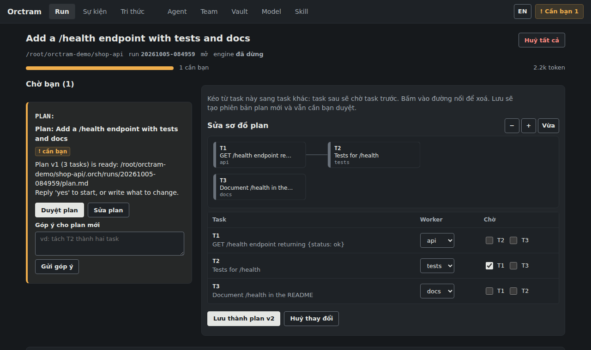
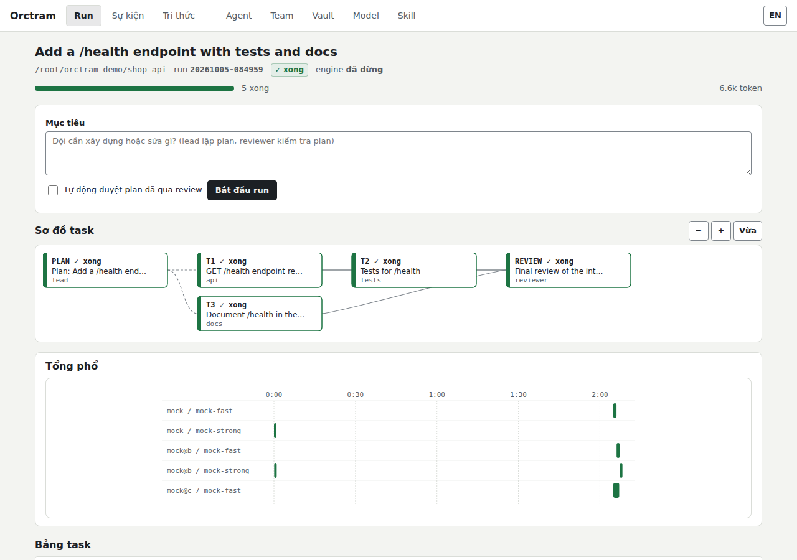
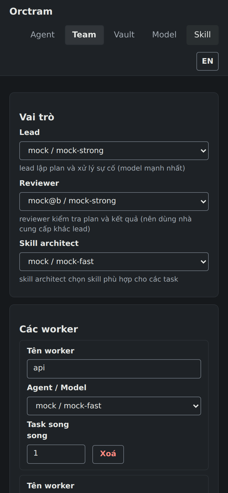

# Orctram

**Nhiều agent đề xuất, engine kiểm chứng.** Orctram điều phối nhiều AI coding agent CLI (codex, claude, agy, opencode, gemini …) ngay trên máy của bạn. Tên cũ của dự án là Orchestra (rồi Hoatau); bên trong vẫn giữ gói `orch`, thư mục `.orch/` và `~/.orchestra` để dữ liệu cũ dùng tiếp được.

Cách làm việc:
- Một lead lập plan cùng reviewer.
- Các worker làm song song, mỗi worker trong một git worktree riêng.
- Engine tự kiểm tra, verify và gộp kết quả vào nhánh `orch/<run>/main`.
- Bạn chỉ được hỏi khi việc vượt quyền của lead.

Thiết kế đầy đủ, trạng thái hiện tại và biên bản trao đổi với Codex nằm ở [PLAN.md](PLAN.md).

| Duyệt và sửa plan (tối) | Run đã xong (sáng) | Tab Team trên điện thoại |
|---|---|---|
|  |  |  |

Ảnh chụp từ một run với agent giả (`mock`), không phải agent thật.

## Yêu cầu

- Windows 10/11 (đã chạy với agent thật). Linux và macOS: bộ test chạy qua trên CI ở mỗi lần push, nhưng chưa chạy với agent thật.
- Python 3.11 trở lên. Chỉ dùng thư viện chuẩn, không có dependency nào.
- git.
- Ít nhất một agent CLI đã cài và đăng nhập. Trên máy này đã dùng được `codex`, `agy` và `opencode@free` (model free của OpenCode Zen, không cần tài khoản).

## Cài đặt

Cài thành lệnh `orctram` trong một môi trường riêng (chưa có trên PyPI; cài thẳng từ GitHub):

```bash
pipx install "git+https://github.com/giaminhh041223/Hierarchical-Multi-Agent.git#subdirectory=prototype"
```

Khi đã phát hành lên PyPI: `pipx install orctram`. Hoặc `uv tool install` với cùng địa chỉ. Sau khi cài, `orctram <lệnh>` tương đương `python -m orch <lệnh>` trong tài liệu này, và chạy được từ bất kỳ thư mục nào. Không cài cũng được: chạy `python -m orch` từ thư mục `prototype/` như dưới đây.

## Bắt đầu nhanh

Không cài thì mọi lệnh chạy từ thư mục này (`prototype/`). Dự án đích chọn bằng `--ws <thư mục>`, đặt **trước** tên lệnh. Cũng có thể đặt biến `ORCH_WS`, hoặc đứng trong thư mục dự án và thêm `prototype/` vào `PYTHONPATH`.

0. Kiểm tra máy đã sẵn sàng chưa: `python -m orch doctor` (hoặc `orctram doctor`).

1. Tìm agent, model và trạng thái đăng nhập. `--probe` gửi một lời gọi rất nhỏ tới từng agent để chắc chắn nó dùng được.

   ```bash
   python -m orch discover --probe
   ```

2. Đăng nhập agent còn thiếu, hoặc lưu API key vào vault (mã hoá DPAPI):

   ```bash
   python -m orch login claude
   ```

   ```bash
   python -m orch vault set ZAI_API_KEY
   ```

3. Chọn đội cho dự án. Lệnh này:
   - liệt kê agent/model, gợi ý lead, reviewer, skill architect và worker;
   - probe các model được chọn;
   - ghi `.orch/team.json` và `.orch/rules/`.

   Dự án chưa có commit nào thì lệnh đề nghị `git init` kèm commit đầu tiên.

   ```bash
   python -m orch --ws D:/du-an-cua-ban init
   ```

4. Giao mục tiêu. Engine chạy ở cửa sổ này cho tới khi xong. Khi cần bạn, nó chờ câu trả lời; thêm `--exit-on-wait` để engine thoát với mã 3 thay vì chờ.

   ```bash
   python -m orch --ws D:/du-an-cua-ban run "Thêm endpoint /health kèm test"
   ```

5. Ở cửa sổ khác, xem việc đang chờ bạn và trả lời. Đầu tiên là duyệt plan: plan nằm ở `.orch/runs/<run>/plan.md`.

   ```bash
   python -m orch --ws D:/du-an-cua-ban inbox
   ```

   ```bash
   python -m orch --ws D:/du-an-cua-ban answer PLAN "yes"
   ```

   Nếu engine đã dừng (dùng `--exit-on-wait`, Ctrl+C, hoặc crash), chạy tiếp bằng `resume`:

   ```bash
   python -m orch --ws D:/du-an-cua-ban resume
   ```

6. Hoặc làm mọi thứ trên web UI. UI chỉ mở trên 127.0.0.1, link in ra đã kèm token truy cập. Tab Run vẽ sơ đồ DAG của run: mỗi cột một độ sâu phụ thuộc, màu theo trạng thái; di chuột lên node để xem chi tiết. Khi plan chờ duyệt, nút **Edit plan** cho bạn tự sửa: kéo từ task này sang task kia để thêm dependency, bấm vào đường nối để bỏ, chọn worker cho từng task. Bản sửa được lưu thành phiên bản mới và vẫn chờ bạn `yes`.

   ```bash
   python -m orch --ws D:/du-an-cua-ban ui
   ```

7. Đọc `.orch/runs/<run>/report.md`, xem diff, rồi tự merge khi hài lòng. Engine không bao giờ đụng vào nhánh của bạn.

   ```bash
   git merge orch/<run>/main
   ```

## Lệnh

| Lệnh | Việc |
|---|---|
| `bench "<mục tiêu>" --check "<lệnh>" [--check …] [--solo agent/model] [--repeat N] [--mode auto\|solo] [--team-file f.json]` | So sánh: một agent làm một mình (một lời gọi, kèm một lượt repair như mọi lời gọi của engine; không plan, không review) và cả đội (run tự duyệt plan), cùng commit gốc, chấm bằng cùng lệnh `--check` của bạn. `--mode` thêm nhánh "cả đội ở chế độ đó", `--team-file` thêm một đội khác, `--repeat` chạy mỗi nhánh N lần xen kẽ và báo trung vị. Báo cáo: số lần đạt hết check, token, $ (CLI báo hoặc ước tính theo giá OpenRouter), số lời gọi, số câu hỏi cho bạn, thời gian. Ghi ở `.orch/bench/<id>/report.md`. Bộ việc chuẩn: [benchmarks/](benchmarks/). |
| `doctor` | Kiểm tra máy (Python, git, SQLite FTS5, thư mục dữ liệu, agent CLI đã cài, port UI) và, với `--ws`, dự án (git, team, DB, engine). Chỉ kiểm tra tại chỗ: không gọi mạng, không gọi agent, không in secret. Mã thoát 1 khi có lỗi chặn. |
| `discover [--probe] [--only codex,agy]` | Tìm agent CLI, model và trạng thái đăng nhập. Kết quả ghi vào `~/.orchestra/resources.json`. |
| `login <agent>` | Mở luồng đăng nhập của chính CLI đó. Với claude: gõ `/login` trong cửa sổ mở ra. |
| `vault list` · `vault set NAME` · `vault rm NAME` | Quản lý API key: nhập ẩn, mã hoá DPAPI, chỉ hiển thị dạng đã che. |
| `models refresh` · `models show [id…]` · `models suggest` | DB model:<ul><li>`refresh` tải dữ liệu Epoch AI và OpenRouter.</li><li>`show` in thẻ model.</li><li>`suggest` gợi ý đội.</li></ul> |
| `skills list` · `skills refresh` · `skills approve <url>` · `skills reject <url>` | Chỉ mục skill:<ul><li>`refresh` gọi GitHub API.</li><li>`approve` / `reject` duyệt repo ngoài danh sách.</li></ul> |
| `init [--yes] [--team file.json] [--no-probe]` | Chọn đội cho dự án. |
| `pool` · `pool plan [--preset steady\|match\|precise] [--criteria "s=3,t"] [--per 1] [--no-test] [--hard] [--yes]` · `pool test [--hard] [agent/model …]` | Resource planner:<ul><li>`pool` in quota của từng tài khoản và backup của từng worker.</li><li>`plan` xếp hạng, pre-test rồi lưu pool backup.</li><li>`test` thử lại vài model.</li><li>`--hard` dùng bài pre-test khó.</li></ul>Xem [Hết usage](#hết-usage-xoay-vòng-và-pool-backup). |
| `run "<mục tiêu>" [--yes] [--exit-on-wait]` | Bắt đầu một run. `--yes` tự duyệt plan sau khi reviewer đã review. |
| `resume [--exit-on-wait]` | Chạy tiếp run hiện tại. |
| `status` · `board` · `inbox` | Xem tình hình run, bảng task, việc đang chờ bạn. |
| `answer <task> "<trả lời>"` | Trả lời một task đang chờ. |
| `cancel <task \| all>` | Huỷ một task (kéo theo các task phụ thuộc nó) hoặc huỷ cả run. |
| `log [-n 40]` | Xem các sự kiện gần nhất. Đây là kênh chung của cả đội. |
| `kg search <từ khoá> [-k 8]` · `kg links <node>` · `kg add <entity> <fact>` | Knowledge graph dùng chung. |
| `mcp [--control]` | MCP server qua stdio: board và knowledge graph thành tool chỉ đọc; `--control` thêm tool để phiên Claude Code / Codex của bạn chạy và theo dõi run. Xem [MCP server](#mcp-server). |
| `ui [--port 8765] [--no-browser]` | Web UI. Cổng bận thì tự chọn cổng khác (khi dùng worker từ xa, đường hầm phải theo đúng cổng in ra). |
| `remote run [--url …] [--agents codex,agy] [--name …] [--once]` | Chạy trên máy khác: phục vụ agent CLI của máy đó cho engine. Xem [Worker chạy từ xa](#worker-chạy-từ-xa). |

Mã thoát của `run` và `resume`:
- `0`: xong;
- `3`: đang chờ bạn;
- `1`: thất bại hoặc bị huỷ.

## Trả lời câu hỏi

| Task đang chờ | Câu trả lời |
|---|---|
| `PLAN` | <ul><li>`yes` / `có` / `duyệt` / `ok` / `lgtm`: bắt đầu.</li><li>Viết góp ý: lead lập lại plan theo góp ý.</li></ul> |
| Task công việc | <ul><li>`retry`;</li><li>`reassign <worker>`;</li><li>`cancel` / `skip` / `hủy` / `bỏ qua`;</li><li>văn bản tự do: thành chỉ dẫn cho lần thử sau.</li></ul> |
| `BUDGET<n>` | Ngân sách token mới (`500k`, `2m`, `5000000`) hoặc `stop`. |
| `REVIEW<n>` | <ul><li>`accept` / `yes`: kết thúc.</li><li>`retry`: review lại.</li><li>Mô tả việc cần làm: lead bổ sung task.</li></ul> |

## Hết usage: xoay vòng và pool backup

> **Điều khoản của nhà cung cấp.** Tính năng này lập lịch công việc trên **các tài khoản và key bạn sở hữu hợp lệ**, để run không đứng yên khi một quota cạn. Nó không phải công cụ lách hạn mức. Điều khoản của nhiều nhà cung cấp cấm chia sẻ tài khoản, mở nhiều tài khoản để vượt hạn mức, hoặc dùng gói thuê bao cá nhân qua công cụ bên thứ ba; một số hãng từng chặn việc này trên thực tế. Hãy đọc điều khoản của từng hãng. Dùng chung với nhóm, trên máy chủ hay trong CI thì dùng API key.

**Tài khoản** là một quota. Thường mỗi agent id (`codex`, `agy`, `opencode@free` …) là một tài khoản. Riêng router (`opencode@9router`) thì mỗi nhà cung cấp phía sau là một tài khoản, và nhà cung cấp trùng subscription với một CLI (`cx/` = codex) được tính chung với CLI đó.

**Khi một tài khoản hết usage giữa run**, engine xử lý như sau, không tốn token:
- **Khoá cả tài khoản.** Mọi worker và vai trò dùng tài khoản đó tạm dừng tới giờ reset. Giờ reset lấy theo thứ tự:
  1. thông báo lỗi của CLI;
  2. bản ghi quota của chính CLI (codex);
  3. tham số `cooldown` (mặc định 3600 s).
- **Reset sắp tới hoặc không có ai thay:** task chờ. "Sắp tới" nghĩa là trong vòng `wait_reset` (mặc định 600 s).
- **Còn lâu mới reset:** một worker dự phòng làm tiếp ngay trong worktree đó, giữ phần việc dở.
- **Sau giờ reset:** task tự quay về worker chính ở lần thử kế tiếp. Engine không cắt ngang backup đang chạy.
- **Task còn trong hàng đợi** của tài khoản đã hết được chuyển ngay, khỏi phải tốn một lời gọi thất bại.
- **Lead, reviewer, skill architect** được một vai trò hoặc worker khác đứng thay.

Thứ tự chọn người thay:
1. Worker còn slot trống trước.
2. Rồi lần lượt:
   1. backup được lập riêng cho worker đó;
   2. backup viết tay;
   3. backup của worker khác;
   4. worker chính khác.
3. Không bao giờ chọn tài khoản đang bị khoá.

**Resource planner** là một vai trò tất định: code, không phải LLM, nên không tốn token. Đầu mỗi `run` và `resume`, nó:
- Đọc quota của từng tài khoản.
  - Codex: đọc từ chính rollout của codex. Chỉ đọc object `rate_limits`, không đọc nội dung hội thoại.
  - Agent khác: học từ lỗi của chúng.
- Ghi vào `plan.md` mục `## Resources`: % đã dùng, giờ reset, và dự báo "hết lúc ~HH:MM theo tốc độ hiện tại".
- Khoá trước tài khoản đã hết.
- Cảnh báo khi một tài khoản có thể hết trước giờ reset mà worker của nó chưa có backup.

```bash
python -m orch --ws D:/du-an-cua-ban pool plan
```

`pool plan` làm lần lượt:
1. Bạn tick tiêu chí, hoặc chọn một trong 3 preset.
2. Engine xếp hạng mọi model đã đăng nhập.
3. Engine pre-test 3 ứng viên đầu của mỗi worker bằng một task code nhỏ. Engine tự chấm kết quả, không tin lời model.
   - Khi `n`, `c`, `r` hoặc `h` có trọng số 3 (preset `match`, `precise`) hoặc có `--hard`, engine dùng bài khó hơn: số La Mã hai chiều, phải từ chối chuỗi không chuẩn.
4. Engine lưu ứng viên tốt nhất vào `team.json` làm backup của từng worker.

Các trường hợp luôn bị loại:
- model cùng tài khoản với worker chính, vì sẽ hết usage cùng lúc;
- tài khoản đã dùng ≥ 90%;
- model đang làm worker chính;
- model có lần pre-test gần nhất lỗi nặng: auth, sai model, trả lời sai hợp đồng.

| Tiêu chí | Đo gì |
|---|---|
| `s` ổn định | Tỉ lệ lời gọi không bị quota / rate limit / timeout cắt ngang, tức không bị "bóp token". Lấy từ lịch sử của bạn và pre-test. |
| `c` code | Percentile SWE-bench Verified, Terminal-Bench, METR time horizon. |
| `r` suy luận | Percentile GPQA Diamond, HLE, Epoch ECI. |
| `h` trung thực | Tỉ lệ "done" qua được verify. Càng cao thì càng ít ảo giác. |
| `n` tương đương | Năng lực gần worker chính nhất. Model mạnh hơn chỉ bị trừ nửa điểm. |
| `q` nhanh | 30 s = 1 điểm, 10 phút = 0 điểm. |
| `f` free | Không tốn quota trả phí. |
| `t` tin cậy | Bộ lọc: chỉ giữ model có kết quả benchmark công khai. Cần chạy `models refresh`. |

| Preset | Trọng số | Khi nào dùng |
|---|---|---|
| `steady` (mặc định): Ổn định, không đứt gãy | s3 q2 f2 h1 c1 | Gián đoạn ngắn, cần công việc chảy liên tục. |
| `match`: Năng lực tương đương | n3 c3 r2 s1, lọc t | Gián đoạn dài, task cốt lõi. |
| `precise`: Chính xác, ít ảo giác | h3 r3 s1 c1, lọc t | Task nhạy cảm. |

Cách tính điểm:
- Điểm = trung bình có trọng số của các tiêu chí.
- Tiêu chí chưa có dữ liệu tính 0,5.
- Cột `conf` cho biết bao nhiêu phần trọng số có dữ liệu thật.
- Tài khoản có thể hết trước giờ reset (at risk) chỉ giữ 75% số điểm.

Chỉnh tiêu chí:
- Trong hộp thoại: gõ chữ cái để bật/tắt, `c=3` để đặt trọng số, số `1`–`3` để chọn preset.
- Trên dòng lệnh: `--criteria "s=3,q=2,t"`.

## 9router (tuỳ chọn): nhiều API AI free qua một endpoint

> **Tự chịu rủi ro.** Router đưa quyền dùng của các gói thuê bao sang công cụ khác; điều đó có thể trái điều khoản của nhà cung cấp phía sau (xem lưu ý ở [Hết usage](#hết-usage-xoay-vòng-và-pool-backup)). Orctram chỉ là client của router, không khuyến nghị dùng gói thuê bao theo cách này.

[9router](https://github.com/decolua/9router) là router chạy local, có endpoint tương thích OpenAI tại `http://127.0.0.1:20128/v1`. Nó gom nhiều nhà cung cấp, có cả gói free, nên làm pool backup rất hợp. Orctram dùng nó qua profile `opencode@9router`: opencode gọi router, key lấy từ vault và không bao giờ ghi vào file cấu hình.

Prototype không cài 9router. Tự cài nếu bạn muốn, theo các bước:

1. Cài từ npm: gói `9router`, khoảng 54 MB, MIT. Đọc README của repo trước.
2. Cấu hình an toàn **trước khi** đăng nhập dashboard:
   - `HOSTNAME=127.0.0.1`: Docker mặc định `0.0.0.0`.
   - `REQUIRE_API_KEY=true`: mặc định `false`.
   - Đổi `INITIAL_PASSWORD`: mặc định `123456`.
   - Tắt Cloud Sync nếu không cần.
   - Không bật các tính năng MITM, cài chứng chỉ hay DNS.
3. Trên dashboard (`http://127.0.0.1:20128`): kết nối các nhà cung cấp, tạo API key.
4. Gửi key cho Orctram và kiểm tra:

   ```bash
   python -m orch vault set NINEROUTER_API_KEY
   ```

   ```bash
   python -m orch discover --only opencode@9router --probe
   ```

5. Model của router xuất hiện dạng `opencode@9router/<provider>/<model>`. `pool plan` tự xếp hạng và pre-test chúng.

Router chạy port khác 20128? Ghi đè trong `~/.orchestra/agents.json`. File này chỉ áp dụng trên máy của bạn; catalog trong repo giữ nguyên:

```json
{"opencode@9router": {"router": "http://127.0.0.1:PORT/v1"}}
```

Engine gửi kèm header `X-9Router-Token-Saver: off`. Lý do: tính năng nén prompt của router có thể làm hỏng hợp đồng JSON giữa engine và worker.

## Dùng Claude Code hoặc Codex làm lead tương tác

Mở Claude Code hoặc Codex trong dự án của bạn và bảo nó điều khiển Orctram qua CLI, ví dụ:

> dùng `python -m orch --ws . status`, `inbox`, `answer`, `kg search` để theo dõi và xử lý run

Gọn hơn: đăng ký MCP server với `--control` ([MCP server](#mcp-server)); agent của bạn có sẵn tool `run`, `status`, `answer`.

Bên trong run, worker đã có sẵn `ORCH_WS` và `PYTHONPATH`, nên tự tra knowledge graph được bằng `python -m orch kg search …`.

## Knowledge graph

Task đã tích hợp công bố fact; bạn thêm bằng `kg add`. Engine chèn các fact liên quan vào packet của mỗi task. Agent tra bằng `kg search` hoặc tool MCP `kg_search`.

Tìm kiếm gộp hai bảng xếp hạng:
- từ khoá (SQLite FTS5/BM25);
- vector. Mặc định là trigram ký tự tính ngay trên máy, không gửi gì ra ngoài. Cách này tìm được từ viết gần đúng và từ gõ không dấu, ví dụ `dang nhap` thấy "Đăng nhập".

**Tìm theo nghĩa (tuỳ chọn).** Thêm vào `team.json` một endpoint `/embeddings` kiểu OpenAI, ví dụ Ollama trên máy bạn:

```json
"embeddings": {"url": "http://127.0.0.1:11434/v1", "model": "nomic-embed-text", "key": null, "min": 0.3}
```

- **Nội dung các fact được gửi tới `url`.** Muốn fact không rời máy thì dùng endpoint chạy trên máy.
- `key`: tên biến môi trường hoặc mục vault chứa API key, ví dụ `"OPENAI_API_KEY"` sau khi `vault set OPENAI_API_KEY`. Key đi qua header Bearer. Để `null` nếu endpoint không cần.
- `min`: độ tương đồng cosine tối thiểu, mặc định 0.3.
- Vector được lưu trong `orch.db`, nên mỗi fact chỉ gửi một lần cho mỗi model.
- Endpoint lỗi thì tìm bằng trigram và ghi một dòng ra stderr (`engine.log` khi chạy từ UI).

## MCP server

`python -m orch --ws <dự án> mcp` chạy một MCP server qua stdio. Server có ba tool, đều chỉ đọc:

| Tool | Trả về |
|---|---|
| `board` | Mục tiêu và trạng thái run; từng task với trạng thái, worker, số lần thử, phụ thuộc. |
| `kg_search` | Các fact mà task đã tích hợp công bố, tìm theo từ khoá và vector ([Knowledge graph](#knowledge-graph)). |
| `kg_links` | Quan hệ của một node. Task: file nó đã sửa, task nó chạy sau. File: các task đã sửa file đó. |

**Cho agent trong run.** Đặt `"mcp": true` trong `team.json`. Engine truyền server cho từng lời gọi agent bằng cờ hoặc biến môi trường của chính lời gọi đó, không ghi file cấu hình nào của CLI:
- codex: `-c mcp_servers.orch={…}`;
- claude: `--mcp-config` và thêm `mcp__orch` vào `--allowedTools`;
- opencode và các profile của nó: `OPENCODE_CONFIG_CONTENT`.

agy, gemini và cursor-agent chưa có cách truyền theo từng lời gọi, nên vẫn tra bằng lệnh CLI.

**Giao việc cho cả đội từ Claude Code hoặc Codex (`--control`).** Thêm `--control` thì server có thêm các tool điều khiển run. Phiên agent của bạn giao một mục tiêu cho đội nhiều hãng, theo dõi tiến độ, rồi chuyển câu trả lời của bạn:

| Tool | Việc |
|---|---|
| `run` | Bắt đầu run cho một mục tiêu; trả về ngay. `auto_approve` chỉ khi bạn yêu cầu. |
| `status` | Bảng task, engine đang chạy hay dừng, câu hỏi đang chờ bạn, và báo cáo cuối khi xong. |
| `answer` | Chuyển câu trả lời của **bạn** cho task đang chờ (`yes`, `retry`, `cancel`, `reassign <worker>`, hoặc chỉ dẫn). Engine dừng thì tool tự khởi động lại. |
| `resume`, `cancel` | Chạy tiếp run đang mở; huỷ một task hoặc `all`. |
| `doctor` | Kiểm tra máy và dự án, như lệnh `doctor`. |

- Engine chạy thành tiến trình nền và tự thoát khi chỉ còn chờ bạn, nên phiên MCP không bị treo.
- Mô tả tool dặn agent không tự duyệt plan: duyệt plan cũng là cho phép các lệnh verify trong đó. Claude Code và Codex vẫn hỏi bạn trước mỗi lần gọi tool.
- Engine thừa hưởng môi trường của server MCP. Nếu engine không tìm thấy agent CLI, truyền `PATH` vào cấu hình server.
- Agent bên trong run không bao giờ nhận `--control`: server mà engine truyền cho chúng vẫn chỉ đọc.

```bash
claude mcp add orctram -- orctram --ws D:/du-an mcp --control
```

**Chỉ đọc, cho phiên Claude Code hoặc Codex của bạn.** Bạn tự đăng ký, Orctram không ghi cấu hình của bạn. Chưa cài `orctram` thì đặt `PYTHONPATH` là thư mục `prototype/`:

```bash
claude mcp add orch -e PYTHONPATH=D:/Hierarchical-Multi-Agent/prototype -- python -m orch --ws D:/du-an mcp
```

```bash
codex mcp add orch --env PYTHONPATH=D:/Hierarchical-Multi-Agent/prototype -- python -m orch --ws D:/du-an mcp
```

## Worker chạy từ xa

Một máy khác, có agent CLI và login riêng, nhận task như một worker. Engine, kiểm tra scope, verify và merge vẫn chạy ở máy chính.

**Cách nối.** Máy kia gọi vào web UI của máy chính qua đường hầm SSH; không mở port nào ra mạng.

1. Sinh token, rồi đặt cùng một giá trị ở **cả hai** máy, qua biến môi trường hoặc vault:
   ```bash
   python -c "import secrets; print(secrets.token_urlsafe(24))"
   python -m orch vault set ORCH_REMOTE_TOKEN
   ```
2. Máy chính: chạy `python -m orch --ws <dự án> ui` (mặc định port 8765). Dòng `remote runners: on` xác nhận token đã được nhận.
3. Máy kia: mở đường hầm (hai đầu phải cùng port, vì server kiểm tra Host), rồi chạy runner từ `prototype/`:
   ```bash
   ssh -R 8765:127.0.0.1:8765 user@máy-kia
   python -m orch remote run --url http://127.0.0.1:8765 --agents codex
   ```
4. `team.json` ở máy chính: model ghi agent thật và model, cách nhau bằng dấu `:` đầu tiên.
   ```json
   "workers": {"far": {"agent": "remote", "model": "codex:gpt-5.5", "max": 1}}
   ```

**Luồng một lần thử.**
1. Engine chụp worktree của task (cả thay đổi chưa commit) thành một git bundle không có lịch sử.
2. Engine mở một lease và chờ.
3. Runner nhận lease, dựng lại cây trong thư mục tạm, chạy CLI thật và gửi heartbeat.
4. Runner gửi patch nhị phân về; engine áp patch vào worktree rồi kiểm tra scope, verify và gộp như với worker local.

**Cần biết.**
- Runner im lặng quá `ORCH_REMOTE_STALE` giây thì lần thử đó lỗi, engine thử lại một lần. Không runner nào nhận trong `ORCH_REMOTE_WAIT` giây cũng lỗi.
- Bundle không chở lịch sử git. Worker từ xa không có MCP hay knowledge graph.
- Log của runner nằm ở `~/.orchestra/remote/<lease>` trên máy kia.
- Mọi runner của một CLI tính là một tài khoản (`remote/codex`) khi xoay vòng quota.
- Token của UI không mở được route của runner, và ngược lại. Token remote ngắn hơn 16 ký tự thì runner bị từ chối.
- **Ai có `ORCH_REMOTE_TOKEN` và vào được port của UI thì đọc được mã nguồn (bundle) và prompt.** Chỉ dùng qua 127.0.0.1 hoặc đường hầm SSH.

## GitHub Action (beta)

Chạy một đội Orctram trong GitHub Actions và mở pull request chứa kết quả đã verify. Action nằm ở [action/](action/); CI của repo này chạy nó với agent giả, **chưa chạy với agent thật**.

```yaml
# .github/workflows/orctram.yml
on:
  workflow_dispatch:
    inputs:
      goal: {description: "Mục tiêu cho đội", required: true}
permissions:
  contents: write
  pull-requests: write
jobs:
  team:
    runs-on: ubuntu-latest
    steps:
      - uses: actions/checkout@v5
      - run: npm install -g @openai/codex   # các agent CLI mà team dùng
      - uses: giaminhh041223/Hierarchical-Multi-Agent/prototype/action@main
        with:
          goal: ${{ inputs.goal }}
          team: .github/orctram-team.json
        env:
          OPENAI_API_KEY: ${{ secrets.OPENAI_API_KEY }}
```

- **Input:** `goal`, `team` (file JSON cùng dạng `team.json`), `auto-approve` (mặc định `true`, vì trong CI không có ai để hỏi), `open-pr`, `base`, `working-directory`, `python-version`, `github-token`.
- **Output:** `run`, `status` (`done`, `waiting`, `failed`), `branch`, `pr-url`. Báo cáo của run hiện trong phần tóm tắt của job.
- Run cần người trả lời (lỗi đăng nhập, hết ngân sách, lệnh verify ngoài `verify_allow`) thì job thất bại, kèm danh sách câu hỏi.
- PR do `GITHUB_TOKEN` mở sẽ không tự kích hoạt workflow khác (giới hạn của GitHub).

**Bảo mật, đọc trước khi dùng:**
- Trong CI, agent chạy với API key của bạn. `goal` là prompt cho chúng: **đừng nối thẳng nội dung issue hay comment của người lạ vào `goal`**. Chỉ kích hoạt bằng `workflow_dispatch`, hoặc label do maintainer gắn.
- Dùng API key, không dùng subscription cá nhân: điều khoản của hầu hết nhà cung cấp không cho phép đem gói cá nhân lên máy CI dùng chung.
- Nên đặt `verify_allow` trong file team: lệnh verify do model viết; ngoài danh sách thì run dừng lại thay vì chạy.
- Lệnh verify vẫn chạy với danh sách biến môi trường cho phép, nên không thấy API key.

## Chi phí từng lời gọi

`report.md` của mỗi run có bảng **Calls**: token, thời gian và cỡ prompt (KB) của từng lời gọi agent, để biết token tốn vào đâu. Khi CLI không báo chi phí, cột `$` ước tính theo giá OpenRouter (`models refresh`), đánh dấu `~`; model free tính 0, gói thuê bao không tính theo token.

## Workspace

Engine đặt `<dự án>/.orch/` vào `.git/info/exclude`, nên thư mục này không lọt vào commit. Nội dung:

```
.orch/
  orch.db                 tasks, attempts, plans, events (kênh chung), facts, links, vectors, skills
  team.json               đội và tham số
  rules/                  common.md, lead.md, reviewer.md, worker.md, skill_architect.md, <worker>.md
  runs/<run>/plan.md      plan để bạn duyệt
  runs/<run>/report.md    báo cáo cuối: task, commit, token và chi phí theo agent/model
  runs/<run>/attempts/    prompt, đầu ra, log verify của từng lần gọi
```

Bạn sửa `rules/` tự do; engine chỉ tạo file khi file chưa có.

Dữ liệu dùng chung giữa các dự án nằm ở `~/.orchestra/` (đổi bằng `ORCH_HOME`): `resources.json`, `vault.dpapi`, `history.db`, `skills/`, và các worktree trong `wt/`.

## team.json

`init` tạo file này. Bạn có thể viết tay rồi dùng `init --team file.json`.

```json
{
  "lead":            {"agent": "codex", "model": "<model>"},
  "reviewer":        {"agent": "agy",   "model": "<model>"},
  "skill_architect": {"agent": "agy",   "model": "<model>"},
  "workers": {
    "codex-1": {"agent": "codex", "model": "<model>", "max": 1},
    "agy-2":   {"agent": "agy",   "model": "<model>", "max": 1},
    "oc-3":    {"agent": "opencode@free", "model": "opencode/big-pickle", "max": 1, "backup": true}
  },
  "wait_reset": 600,
  "cooldown": 3600,
  "max_parallel": 4,
  "timeout": 1800,
  "verify_timeout": 600,
  "budget_tokens": 0,
  "max_amend": 1,
  "skills": true,
  "auto_approve": false,
  "account_max": {},
  "verify_allow": null,
  "verify_env": [],
  "mode": "team",
  "solo": null,
  "verify": [["python", "-m", "pytest", "-q"]],
  "mcp": false,
  "embeddings": null,
  "notify_url": null
}
```

| Trường | Ý nghĩa |
|---|---|
| `agent` | Id trong [orch/catalog/agents.json](orch/catalog/agents.json): `codex`, `claude`, `claude@zai`, `agy`, `opencode`, `opencode@free`, `opencode@9router`, `gemini`, `cursor-agent`. Một id là một tài khoản, tức một quota; router thì mỗi nhà cung cấp một tài khoản ([Hết usage](#hết-usage-xoay-vòng-và-pool-backup)). |
| `max` | Số task một worker chạy cùng lúc. |
| `backup` | Worker chỉ đứng thay, không có trong danh sách lead dùng để lập plan. |
| `for` | Danh sách worker chính mà backup này được lập riêng cho. `pool plan` tự ghi trường này. Thiếu `for` thì backup đứng thay cho tất cả. |
| `wait_reset` | Reset trong vòng chừng này giây thì chờ, không xoay vòng. |
| `cooldown` | Thời gian khoá một tài khoản hết usage khi CLI không nói giờ reset. Đây cũng là mốc bật lại model chính. |
| `pool` | Preset, tiêu chí và thời điểm của lần `pool plan` gần nhất. |
| `max_parallel` | Tổng số task chạy song song. |
| `timeout` | Thời gian tối đa (giây) cho mỗi lần gọi agent. |
| `verify_timeout` | Thời gian tối đa (giây) cho mỗi lệnh verify. |
| `budget_tokens` | Ngân sách token của run. `0` = không giới hạn. |
| `max_amend` | Số lần lead được bổ sung task sau review cuối. |
| `skills` | `true`: skill architect cài skill curated đã chọn. `"propose"`: chỉ đề xuất, task SKILLS hỏi bạn trước khi cài. `false`: tắt. |
| `auto_approve` | Bỏ qua bước bạn duyệt plan. |
| `account_max` | Số task chạy song song tối đa trên một tài khoản, ví dụ `{"codex": 1}` khi hai worker dùng chung một subscription. agy tính quota theo từng model, nên tài khoản của nó là `agy/<model>`. Mặc định không giới hạn. |
| `verify_allow` | Danh sách tiền tố lệnh verify được chạy không cần hỏi, ví dụ `[["python", "-m", "unittest"]]`. Lệnh khác dừng task trước khi gọi worker và hỏi bạn, kể cả khi `auto_approve`; duyệt plan bằng tay cũng là duyệt lệnh trong plan. `null` (mặc định) = không dùng danh sách: duyệt plan bằng tay là duyệt lệnh của plan đó, còn lệnh mới trong bản amend (lead viết sau khi bạn duyệt) vẫn bị hỏi; run `auto_approve` tin lead ở cả hai. |
| `mode` | `team` (mặc định): lead lập plan, reviewer review plan và kết quả. `auto`: lead được dặn việc nhỏ thì trả đúng 1 task; plan 1 task thì bỏ review plan, bỏ skill architect, review cuối chỉ chạy lại verify (không gọi reviewer). `solo`: không gọi lead, engine tự tạo 1 task (cả mục tiêu, phạm vi `.`) cho worker `solo`, verify bằng `verify` của bạn, không cần duyệt. Cả hai chế độ nhẹ vẫn giữ worktree riêng, kiểm tra phạm vi, verify và nhánh tích hợp. Bench thật đầu tiên: việc nhỏ thì đội tốn ~15 lần token và chậm ~4 lần mà chất lượng như nhau. |
| `solo` | Worker làm việc ở chế độ `solo`. Mặc định: worker đầu tiên. |
| `verify` | Lệnh kiểm tra của chính dự án (argv), ví dụ `[["python", "-m", "pytest", "-q"]]`. Bắt buộc ở chế độ `solo`. Lead thấy chúng trong prompt; vì do bạn viết nên không bao giờ phải chờ duyệt. |
| `verify_env` | Tên biến môi trường thêm vào cho lệnh verify, ví dụ `["JAVA_OPTS"]`. Lệnh verify chỉ nhận một danh sách cho phép (hệ thống, locale, thư mục tạm, toolchain như `PYTHON*`, `NODE_*`, `GOPATH`); tên trông giống secret vẫn bị loại. |
| `mcp` | `true`: mỗi lời gọi codex, claude và opencode được nối với [MCP server](#mcp-server) của workspace. Mặc định `false`. |
| `embeddings` | Endpoint `/embeddings` kiểu OpenAI để knowledge graph tìm theo nghĩa; fact được gửi tới đó ([Knowledge graph](#knowledge-graph)). `null` (mặc định) = chỉ dùng từ khoá và trigram trên máy. |
| `notify_url` | Webhook kiểu ntfy/Slack/Discord, gửi khi cần bạn và khi xong. Có thể thay bằng biến `ORCH_NOTIFY_URL`. |

## Biến môi trường

| Biến | Ý nghĩa |
|---|---|
| `ORCH_HOME` | Thư mục dữ liệu chung, mặc định `~/.orchestra`. |
| `ORCH_WS` | Dự án mặc định, thay cho `--ws`. |
| `ORCH_NOTIFY_URL` | Webhook thông báo. |
| `ORCH_REMOTE_TOKEN` | Token của [worker chạy từ xa](#worker-chạy-từ-xa), cùng giá trị trên hai máy, tối thiểu 16 ký tự. Đặt được qua vault. |
| `ORCH_REMOTE_STALE`, `ORCH_REMOTE_WAIT` | Số giây không có heartbeat (mặc định 60) và số giây chờ runner nhận lần thử (mặc định 600). |
| `ORCH_MOCK`, `ORCH_CRASH_AT` | Chỉ dùng cho test. |

## Bảo mật (tóm tắt)

Chi tiết ở [PLAN.md §13](PLAN.md#13-bảo-mật-và-quyền-hạn).

- **Agent chạy với quyền của bạn.** Worktree không phải sandbox. Giới hạn thật là sandbox/permission mode của từng CLI, ví dụ `codex -s workspace-write`.
- **Secret.**
  - Mỗi agent chỉ nhận đúng biến chứng thực adapter của nó cần. Biến trông giống secret (tên chứa `KEY`, `TOKEN`, `AUTH`, `COOKIE` …, hoặc URL có `user:password@`) bị loại.
  - Lệnh verify chạy code do worker viết, nên chỉ nhận một danh sách biến cho phép (`verify_env` thêm tên), không có secret nào.
  - Log, events và UI đều che secret.
- **Git.** Engine commit với hook tắt và không bao giờ ghi vào nhánh hay working tree của bạn.
- **Web UI.** Chỉ mở trên 127.0.0.1, có token, kiểm tra Host và Origin, có CSP.
- **Duyệt plan.** Lệnh verify trong plan do model đề xuất. Hãy đọc chúng trong `plan.md` trước khi trả lời `yes`. Lệnh mới mà lead thêm sau đó (amend) được hỏi riêng. `--yes` / `auto_approve` bỏ qua cả hai, trừ khi bạn đặt `verify_allow`.
- **Reviewer.** Một blocker phải có bằng chứng (lệnh chạy lỗi kèm output, hoặc trích đúng yêu cầu chưa đạt) trong trường `evidence`; thiếu thì engine coi là góp ý, nên không chặn run và không hỏi bạn.
- **Phân loại lỗi.** Hết quota, rate limit, chưa đăng nhập được nhận ra từ lỗi của chính CLI và stderr, không từ transcript của agent: một route `/login` hay file `quota.py` trong dự án không khoá tài khoản.
- **Worker từ xa.** Route riêng, token riêng (`ORCH_REMOTE_TOKEN`); patch vẫn qua scope và verify ở máy chính.

## Kiểm thử

```bash
python tests/test_e2e.py
```

- 37 test end-to-end: Linux khoảng 70 giây, Windows khoảng 2–3 phút. GitHub Actions chạy chúng trên Windows và Linux (Python 3.11, 3.13) ở mỗi lần push, cùng với bản wheel và GitHub Action.
- Parser của các CLI được kiểm bằng đầu ra thật lưu ở [docs/probes/](docs/probes/).
- Dùng mock agent theo kịch bản, không tốn token.
- Riêng test 9router dựng một router giả trên 127.0.0.1. Nếu máy có `opencode` thì test gọi opencode thật qua router giả đó.
- Lọc theo tên: `python tests/test_e2e.py crash`.
- Mỗi test dùng một repo git tạm: tự xoá khi pass, giữ lại để điều tra khi fail.

## Lưu ý

- `models refresh` và `skills refresh` tải dữ liệu từ Internet (Epoch AI, OpenRouter, GitHub API), nên chỉ chạy khi bạn muốn. Chưa refresh thì vẫn có gợi ý đội, nhưng chỉ theo lịch sử chạy của bạn và thứ tự phát hiện, vì chưa có điểm benchmark. Bạn chọn lại được ở bước `init`.
- `claude` đã cài nhưng chưa đăng nhập.
- `opencode` đã nâng lên 1.18.34. Profile `opencode@free` và `opencode@9router` dùng thư mục dữ liệu riêng trong `~/.orchestra`, không đụng dữ liệu opencode của bạn. 8/10 model free trả lời được.
- `agy` không chạy được lệnh shell ở chế độ headless. Engine báo trước cho nó và tự chạy lệnh verify.
- Sandbox của codex trên Windows không thấy `python`: worker codex không tự chạy test được. Engine vẫn verify bên ngoài. Muốn worker tự test thì chỉnh sandbox của codex. Đây là cấu hình của bạn nên prototype không đổi.
- Skill và rule toàn cục của codex (`~/.codex`) cũng được nạp vào worker codex. Hãy để ý nếu chúng mâu thuẫn với `rules/`.
- Hai điểm va chạm với `AGENTS.md` ở thư mục cha cần bạn quyết định: lệnh verify lấy từ plan JSON, và việc tải skill curated tự động. Xem [PLAN.md §13](PLAN.md#13-bảo-mật-và-quyền-hạn).

## Phát hành

Workflow [release.yml](../.github/workflows/release.yml): push tag `vX.Y.Z` (bằng `orch.__version__`) thì CI chạy test, build sdist và wheel, đăng lên PyPI qua Trusted Publishing (không lưu token nào), rồi tạo GitHub Release kèm các file đó.

Một lần, trên PyPI: thêm "trusted publisher" cho repo này, workflow `release.yml`, environment `pypi`. Sau đó:

```bash
git tag v0.1.0 && git push origin v0.1.0
```

## License

[Apache-2.0](LICENSE). Bạn được dùng, sửa và phân phối lại, kể cả cho mục đích thương mại, miễn là giữ thông báo license; license có điều khoản cấp quyền sáng chế.
